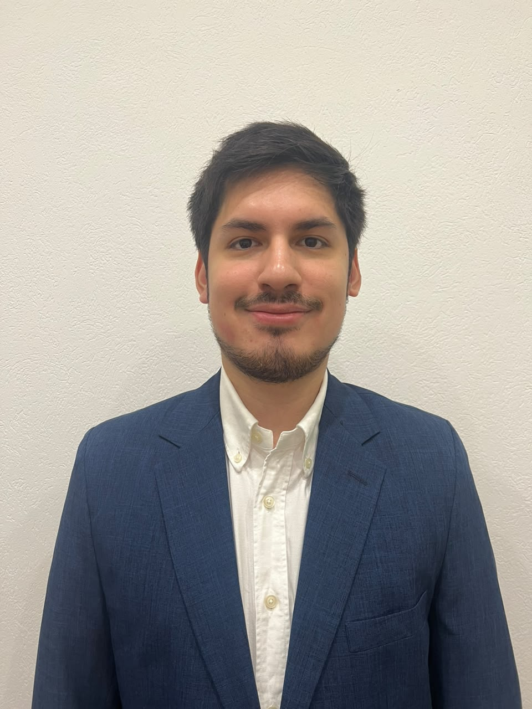

Hola, nosotros somos el grupo HDL (grupo 2).

Este es nuestro repositorio grupal para Paradigma Orientado a Objetos.

Nuestro objetivo es aprender los contenidos de la materia y promocionar.

**Logros:**

-Lautaro Cepurbeda= Deployar un programa serverless hosteado en vercel y conectado por cURL con Nightbot
                    Usar docker para testear un contenedor y hacer una conexion p2p

-Uriel Velardez=    -Realizar un curso de Red Hat Administration | 10.0 
                    -Tstear como QA en un proyecto de desarrollo de app

-Chen Hui Jun= - Haber realizado un proyecto relacionado con ciberseguridad, como detección de phishing/sitios falsos.
               - Haber realizado proyectos utilizando MongoDB, Neo4j y Redis.
               - Haber armado red de clinica en ciscos

**_Gustos:_**

-Lautaro Cepurbeda= La milanesa

-Uriel Velardez: El asado

-Chen Hui Jun: Cualquier comida que cocina mi mamá

**Conocimientos**

-Lautaro Cepurbeda= Python, SQL, cURL, JavaScript, Java, Photoshop, Premiere.

-Uriel Velardez: Python, Javascript, HTML5, Linux.

-Chen Hui Jun: Python, Java, SQL, MongoDB, Neo4j, Redis, Agentes inteligentes, Maven

**Fotos**

-Lautaro Cepurbeda=

-Uriel Velardez=

-Chen Hui Jun=

